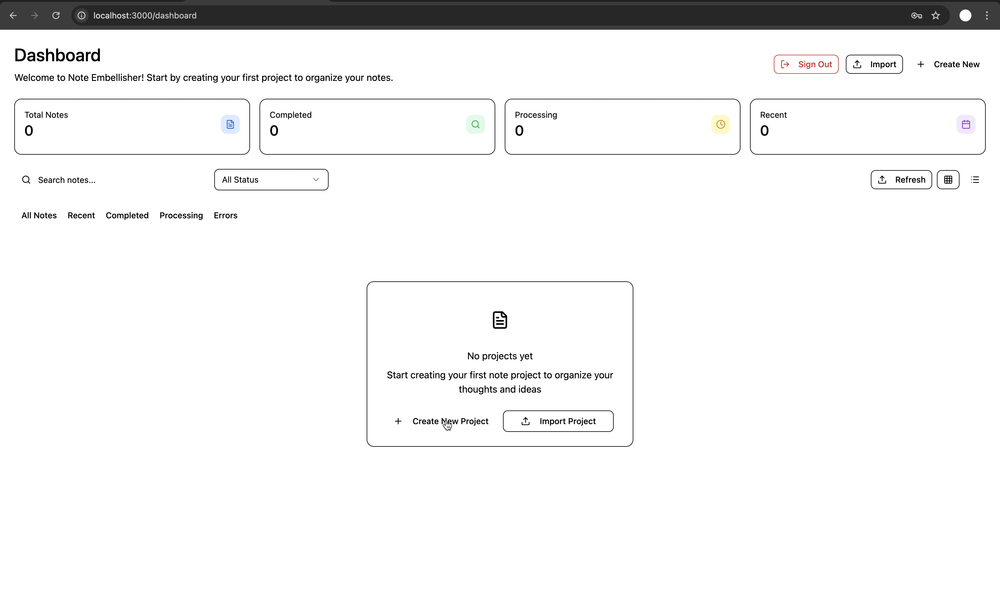
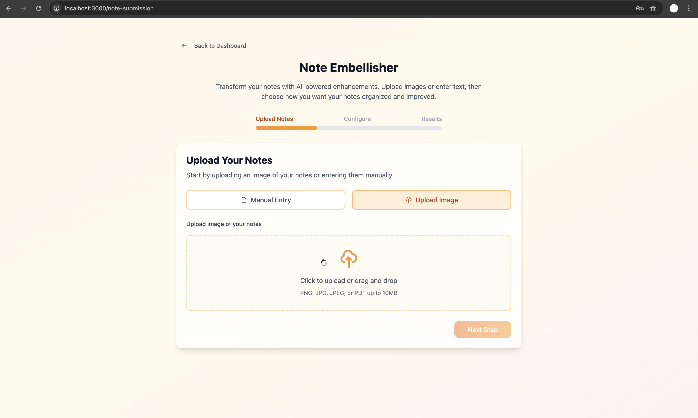
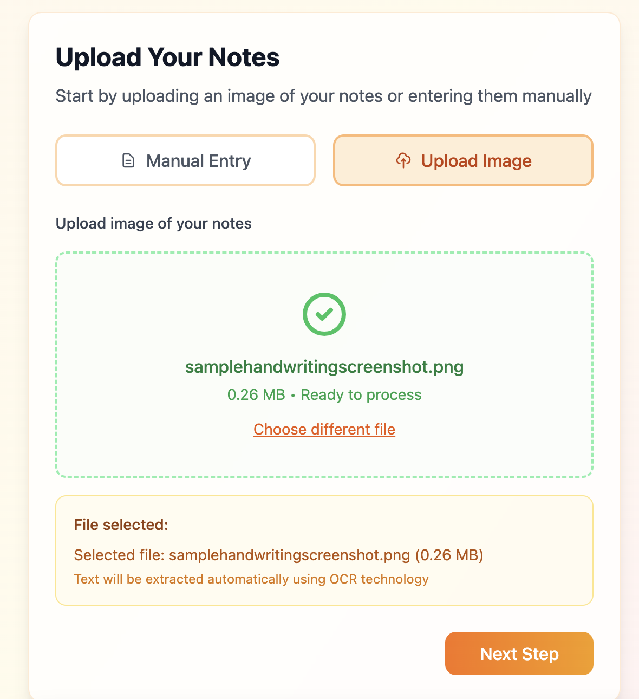
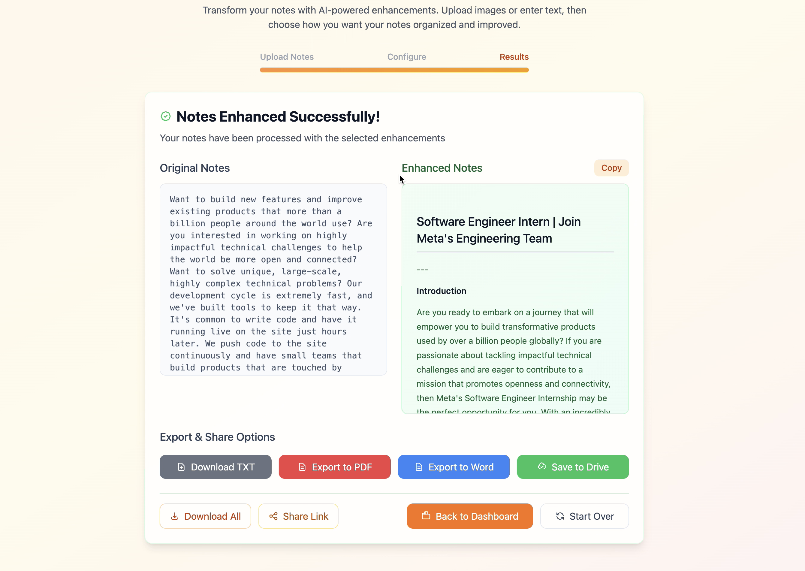

# Note-Embellisher
## Overview
An AI-powered web app platform that transforms messy notes with EasyOCR into well-organized documents with headers, bullet points, and other improvements available for download as PDF/.txt files. 

> A full stack-web app built with FastAPI, ReactJS, EasyOCR, TailwindCSS, Firebase & Dropbox API, deployable on Firebase for the frontend and Render for the backend.


<p align="center">
  
  <br><em>Scanning and embellishing notes in action</em>
</p>

<p align="center">
  
  <br><em>Exporting results and managing dashboard</em>
</p>

## Page layout
1️⃣ **Authentication**
- Users log in via Firebase Authentication
- Accepts Google sign up/email

2️⃣ **Dashboard**
- Displays all previous note projects created by the user
- Allows filtering by date, processing status, etc.
- Allows the user to create new projects

3️⃣ **LLM Embellishment**
 1. Upload notes manually (typed) or an image
 2. Configure the note embellishment
 3. Download the enhanced notes/return to dashboard

<table>
<tr>
<td align="center" width="50%">
  <b>Step 1: Log in & Enter Dashboard</b><br>
  
</td>
<td align="center" width="50%">
  <b>Step 2: Upload File</b><br>
  
</td>
</tr>
<tr>
<td align="center" width="50%">
  <b>Step 3: File Scanned & Uploaded</b><br>
  
</td>
<td align="center" width="50%">
  <b>Step 4: Download Text</b><br>
  
</td>
</tr>
</table>

## Features 
### 1. Authentication

* User authentication handled through Firebase Authentication.

* Each user has an isolated workspace and persistent session management.

### 2. Dashboard and Data Storage

* Displays all uploaded and processed notes.

* Built on Firebase Firestore for structured, real-time data storage.

* Supports filtering and sorting by date, subject, and processing status.

### 3. Dropbox Integration

* Uploaded note images are stored in Dropbox using the official API.

* Each upload is automatically linked to the user’s Firebase profile.

### 4. OCR Processing

* Text extraction from handwritten notes using EasyOCR.

* Supports multiple handwriting styles and variable image quality.

* Provides raw text output for further processing.

### 5. LLM Note Embellishment

* Processes OCR text through an LLM pipeline to improve structure and readability.

* Adds section headers, bullet points, and concise summaries.

* Implements prompt templates to ensure consistent formatting.

### 6. Exports

* Generates downloadable PDF and TXT files for each processed note.

* PDF rendering handled with ReportLab for a clean layout.

* All exported files remain available through the dashboard.

### 7. Filtering and Organization

* Dashboard filtering by date, topic, or note status.

* Enables quick access to specific uploads or previously processed notes.

## Libraries & APIs 
| Layer | Technologies |
|--------|---------------|
| Frontend | React, TailwindCSS |
| Backend | FastAPI, Python |
| Storage | Firebase, Dropbox API |
| AI/OCR | EasyOCR, OpenAI API |
| Output | ReportLab, PDF/TXT Export |

## Architecture
### Main Files

```text
Note Embellisher Project/
├── backend/                  Main backend directory
│   ├── main.py               FastAPI application entry point
│   ├── database.py           CORE: Database models & connection
│   ├── schemas.py            CORE: Pydantic data models
│   ├── chatgpt_service.py    CORE: OpenAI API text processing
│   ├── ocr_service.py        CORE: OCR image text extraction
│   ├── dropbox_service.py    CORE: Cloud file storage
│   ├── firebasesdk.py        CORE: Firebase authentication
│   ├── .env                  CONFIG: Environment variables
│   ├── requirements.txt      CONFIG: Python dependencies
│   ├── Dockerfile            DEPLOY: Container configuration
│   ├── deploy.sh             DEPLOY: Deployment script
│   ├── firebase.config.js    CONFIG: Firebase client config
│   └── firebaseadminsdk.json CONFIG: Firebase admin credentials
│
├── Root Level Files/
│   ├── main.py               Alternative entry point
│   ├── app_minimal.py        Minimal app version
│   ├── requirements.txt      Root dependencies
│   ├── requirements-*.txt    Environment-specific deps
│   ├── render.yaml           Render.com deployment config
│   ├── runtime.txt           Python runtime version
│   ├── build.sh              Build script
│   └── start.sh              Startup script
│
└── frontend/                 Frontend application
    [React/Vue/etc. files
```
### Diagram
```text
                ┌──────────────────────────────┐
                │          Frontend             │
                │  (React / Vue Application)    │
                │──────────────────────────────│
                │  • User Authentication (Firebase Auth)
                │  • Note Upload Dashboard
                │  • OCR Result Display & Editor
                │  • Download as PDF / TXT
                └──────────────┬───────────────┘
                               │  REST API Calls
                               ▼
          ┌──────────────────────────────┐
          │          Backend (FastAPI)   │
          │         ───────────────────  │
          │   main.py  — API entrypoint  │
          │   schemas.py — Pydantic models│
          │   database.py — User/File data│
          └──────┬──────────────┬────────┘
                 │              │
     ┌───────────┘              └──────────────┐
     ▼                                        ▼
┌───────────────┐                    ┌────────────────┐
│  OCR Service  │                    │ ChatGPT Service│
│ (EasyOCR)     │                    │ (OpenAI API)   │
│───────────────│                    │────────────────│
│ Extract text  │   ─────────────▶   │ Clean, summarize│
│ from images   │                    │ & embellish text│
└──────┬────────┘                    └────────┬────────┘
       │ Dropbox upload + metadata            │
       ▼                                      ▼
┌──────────────────┐                 ┌────────────────────┐
│ Dropbox Service  │                 │ Firebase SDK       │
│──────────────────│                 │────────────────────│
│ • Upload & store │                 │ • Auth verification│
│   user images    │                 │ • User file links  │
│ • Retrieve files │                 │ • Admin credentials│
└──────────────────┘                 └────────────────────┘
       │                                      │
       ▼                                      ▼
  ┌──────────────────────────────┐     ┌──────────────────────┐
  │   Persistent Database Layer  │     │ Firebase Console UI  │
  │ (file metadata, history, etc)│     │ (optional dashboard) │
  └──────────────────────────────┘     └──────────────────────┘

```

## 🪪 License
This project is licensed under the MIT License.  
© 2025 github.com/persistentepiphany (persistentepiphany)


